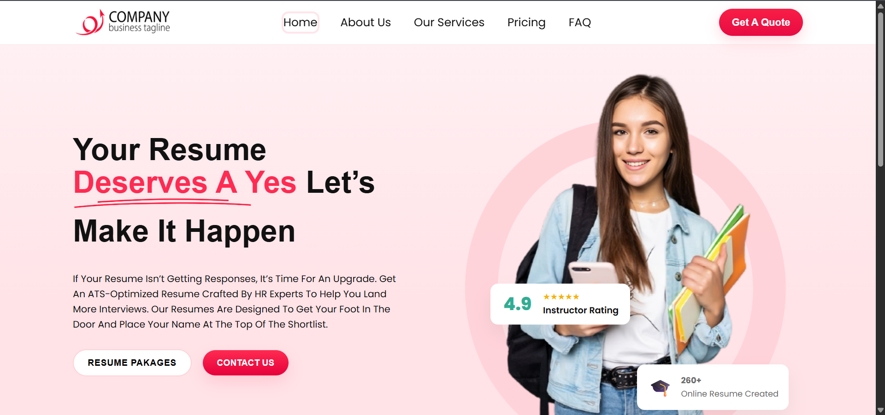
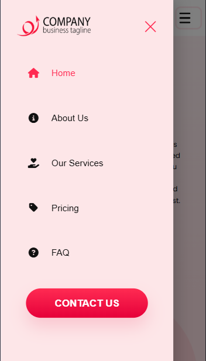

# Front

**Front** is a responsive, pixel-accurate landing page developed from a Figma mockup. The project focuses on creating a clean, modern interface using pure HTML and CSS, optimized for both desktop and mobile views.

---

## 🧠 Overview

This project demonstrates:

* A responsive **navigation bar** with a mobile hamburger menu.
* A visually engaging **hero section** featuring a circular ring behind the main image.
* **Gradient backgrounds**, card shadows, and typography that match the Figma design.
* A modular CSS structure for easy customization and scalability.

---

## 🚀 Setup Instructions

1. **Clone or download** the project to your local machine:

   ```bash
   git clone https://github.com/yourusername/front.git
   ```

   or simply download the ZIP file and extract it.

2. Open the project folder in your code editor (VS Code recommended).

3. Launch the project using one of the following methods:

   * **Option 1:** Open `index.html` directly in your browser.
   * **Option 2 (Recommended):** Use the **Live Server** extension in VS Code for real-time preview and auto reload.

     * Right-click `index.html`
     * Select **"Open with Live Server"**

4. Adjust screen size or use browser dev tools to test responsiveness across mobile, tablet, and desktop breakpoints.

---

## 🧩 Folder Structure

```
Front/
├── index.html
├── styles.css
└── assets/
    ├── images/
    
```

---

## 🎨 Key Features

* **Hero Section:** Gradient background with a broad circular ring behind the hero image.
* **Responsive Layout:** Media queries ensure smooth adjustments across screen sizes.
* **Custom Components:** Floating rating and badge cards on the hero section.
* **Mobile Navigation:** Slide-in mobile menu with overlay and animated icons.
* **Typography:** Clean, professional font pairing using Poppins.

---

## 📸 Preview

*(Add your screenshot or live demo link here)*
Example:




---

## 🛠️ Technologies Used

* **HTML5**
* **CSS3 (Flexbox, Grid, Media Queries)**
* **Google Fonts (Poppins)**

---

## 💡 Future Enhancements

* Add subtle animations to hero elements and menu transitions.
* Introduce a JavaScript toggle for the mobile menu.
* Connect backend or CMS for dynamic content updates.

---

## 👨‍💻 Author

Developed by **Suraj Prajapati**

